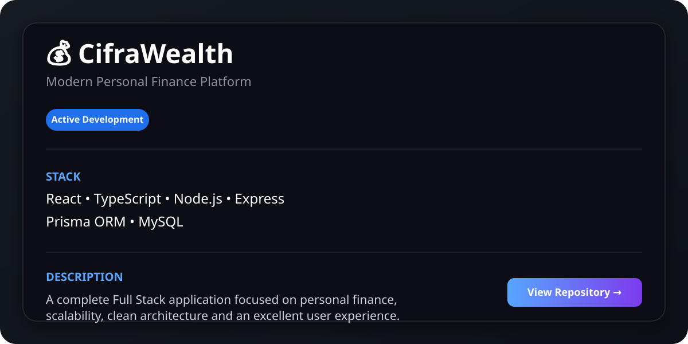
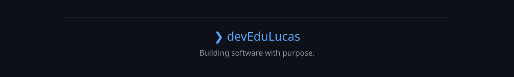

 

# Eduardo Lucas de Oliveira

### Full Stack Software Developer

 

Building modern web and mobile applications with clean architecture.

 

## About

I'm a Full Stack Software Developer passionate about building scalable applications and transforming ideas into real products.

Currently studying Systems Development at SENAI, I focus on developing complete solutions, from database modeling to modern user interfaces.

My main project is **CifraWealth**, where I apply concepts of clean architecture, authentication, REST APIs, relational databases and responsive interfaces.

I'm always looking to improve my skills and learn technologies that help me build better software.

## 💰 Featured Project

### CifraWealth

**A modern personal finance platform built to simplify financial management while applying clean architecture and scalable Full Stack development.**

 

### Main Features

- Secure JWT Authentication
- Expense & Income Management
- Dashboard with financial insights
- REST API architecture
- Responsive Interface
- Clean code organization

### Built With

> 🚧 **Currently under active development**

## 🚀 Tech Stack

  

**Also working with**

React Native • Expo • Prisma ORM • JWT • bcrypt • Railway • Render • Vercel

## 📊 GitHub Analytics

  

## 📈 Contribution Graph

## 📚 Currently Learning

| Learning | Focus |
|----------|-------|
| 🐳 Docker | Containers |
| ☁️ AWS | Cloud |
| ☸️ Kubernetes | Orchestration |
| 🏛 Clean Architecture | Software Design |
| 🎯 Design Patterns | Maintainability |

## 🤝 Let's Connect

